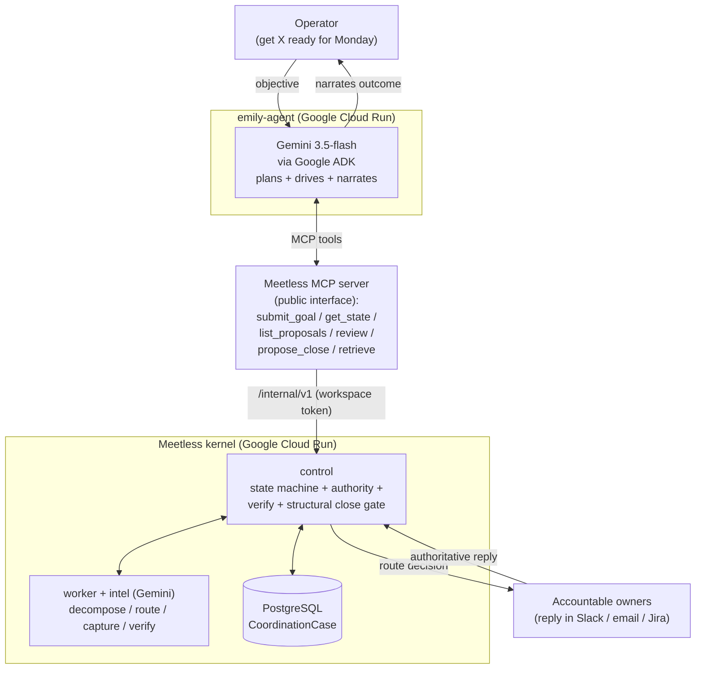

# Emily: an autonomous coordination operator

**Emily is a background agent that gets things done across a company.** You give
her an objective in plain language ("get the Checkout pilot ready for Monday") and
she coordinates the real people and systems needed to finish it: she figures out
what is blocking it, routes each decision to its accountable owner, waits for their
answers, verifies what actually happened, and keeps the work moving until it is
genuinely done. She runs asynchronously, over as long as the work takes, and she
**cannot fake completion**: a Goal is closed by a server-side governance gate, never
by the model claiming it is done.

Built for the **All Things Agentic Hackathon** (Taskmaster track).

- **Reasoning:** Google **Gemini** (`gemini-3.5-flash`)
- **Agent framework:** Google **ADK** (Agent Development Kit)
- **Cloud:** Google **Cloud Run**
- **Coordination backend:** [Meetless](https://meetless.ai), a pre-existing,
  production change-governance platform, integrated over its public MCP interface.
  (Disclosed pre-existing work; the agent in this repository is new.)

## Why this is not another chatbot

Most agents answer questions over a knowledge base. Emily takes **action** across a
company and does it under governance:

- **She plans, the kernel executes and gates.** Emily (Gemini) interprets the
  objective, launches the coordination, supervises it, and judges readiness. The
  Meetless kernel autonomously decomposes the Goal into Conditions, routes each
  decision to its accountable owner, records authoritative decisions, and verifies
  evidence. Emily never decomposes or decides Conditions herself.
- **She waits on the right human.** When a Condition needs an authoritative
  decision, Emily does not invent it; she routes it to the accountable owner and
  parks. The work resumes when the prerequisite becomes true, not when someone
  remembers.
- **She cannot declare "done".** When every Condition is satisfied, Emily *proposes*
  closure. The server's structural gate decides and returns `not_ready` if the
  evidence does not support closing. The model is structurally incapable of lying
  about completion.

## Architecture



```
  Operator ("get X ready for Monday")
        |
        v
  +------------------------+        Model Context Protocol        +---------------------------+
  |   emily-agent (this)   | ----------------------------------> |   Meetless MCP server     |
  |   Google ADK + Gemini  |   submit_goal / get_state /         |   (public interface)      |
  |   3.5-flash            |   list_proposals / review /         +-------------+-------------+
  |   plans + drives       |   propose_close / retrieve          |
  +------------------------+                                     v
        ^                                          +---------------------------------+
        | narrates                                 |   Meetless kernel (Cloud Run)   |
        |                                          |   control + worker + intel      |
        |                                          |   - decomposes the Goal (Gemini)|
        |                                          |   - routes to owners            |
        |                                          |   - captures authoritative      |
        |                                          |     decisions (authority gate)  |
        |                                          |   - verifies Conditions         |
        |                                          |   - structural close gate       |
        |                                          +----------------+----------------+
        |                                                           |
        |                             Slack / email / Jira (owners reply where they already work)
        +-----------------------------------------------------------+
```

Emily only ever calls **six MCP tools** (five coordination verbs plus
`retrieve_knowledge` for grounding). The kernel's in-case planner verbs (decompose,
capture-decision, verify, transition) are deliberately **not** exposed to her, so she
can drive the coordination but can never race the kernel or corrupt a case. See
[`emily_agent/agent.py`](emily_agent/agent.py) and
[`emily_agent/prompt.py`](emily_agent/prompt.py).

## What Emily does, step by step

1. **Ground** the objective with `retrieve_knowledge` (ask the company, not a wiki).
2. **Launch** with `submit_goal`, seating the accountable decision owners.
3. **Supervise**: read `get_state`, and for each proposal the kernel queues
   (`list_proposals`), judge it against the objective and `review_proposal` to
   approve or hold.
4. **Wait honestly** while owners decide; the kernel captures their authoritative
   decisions and verifies each Condition.
5. **Propose closure** with `propose_close`; the server gate rules. If a Condition is
   still open, the gate refuses and Emily reports exactly what is blocking.

## Run it locally

Prerequisites: Python 3.11, Node.js (to run the Meetless MCP server), and a running
Meetless backend (control + worker + intel) with a workspace you can drive.

```bash
python -m venv .venv && source .venv/bin/activate
pip install -r requirements.txt

cp .env.example .env      # fill in GOOGLE_API_KEY, MEETLESS_* (see below)
set -a; source .env; set +a

# Drive Emily one turn and watch Gemini plan + call tools:
python run_local.py "Get the Checkout pilot ready for Monday. Decision owners: <user-id> owns the retry policy."
```

Configuration (see [`.env.example`](.env.example)): a Gemini API key (or Vertex AI),
the Meetless workspace + control token + URLs, and the operator user id. The agent
spawns the Meetless MCP server with these; point `MEETLESS_MCP_SERVER` at your
Meetless MCP build.

## Full end-to-end demo

[`scripts/demo.py`](scripts/demo.py) proves the whole loop against a **real** Meetless
kernel: it provisions a fresh workspace, has Emily launch and drive a Goal, simulates
the accountable humans replying (in production they reply in Slack), and asserts the
Goal reaches `CLOSED` via the server's structural gate. It additionally requires a
local Meetless checkout (to provision the workspace and simulate replies) and
`pip install -r requirements-dev.txt`.

```bash
python scripts/demo.py
```

## Deploy to Cloud Run

```bash
gcloud run deploy emily-agent --source . --region us-central1 \
  --set-env-vars "EMILY_MODEL=gemini-3.5-flash,MEETLESS_BACKEND_URL=...,MEETLESS_INTEL_URL=..." \
  --set-secrets  "GOOGLE_API_KEY=GOOGLE_API_KEY:latest,MEETLESS_CONTROL_TOKEN=MEETLESS_CONTROL_TOKEN:latest"
```

Secrets (the Gemini key and the Meetless workspace token) are stored in Google Secret
Manager, never in this repo.

## Design notes and limitations

- **One planner, one source of truth.** Emily plans the operator work; Meetless is the
  durable coordination runtime and the guardrail. There is intentionally no second
  planner and no local coordination state in this repo.
- **Routing ownership is not decision authority.** In the demo, the bootstrap seats
  the whole preconfigured team as decision owners so the kernel can route each ask to
  a seated stakeholder. That is a demo convenience, not the production model:
  production seats accountable owners deliberately, and the `submit_goal` tool only
  ever seats the specific `decision_owners` it is given.
- **Evidence kinds are a fixed enum.** `submit_goal` rejects an unknown evidence kind
  rather than relabeling it; omit evidence and the tool attaches the operator
  instruction, or pass a real source kind (slack_thread, jira_issue, ...).
- **Grounding depth** depends on the workspace's indexed knowledge; a fresh demo
  workspace has little, so Emily grounds lightly and proceeds.
- Synthetic / demo data is expected for reproduction; do not point Emily at a
  workspace whose data you would not want an operator to act on.

## License

Apache-2.0. Integrates with Meetless (pre-existing, owned by the submitting team),
disclosed per the hackathon rules.
